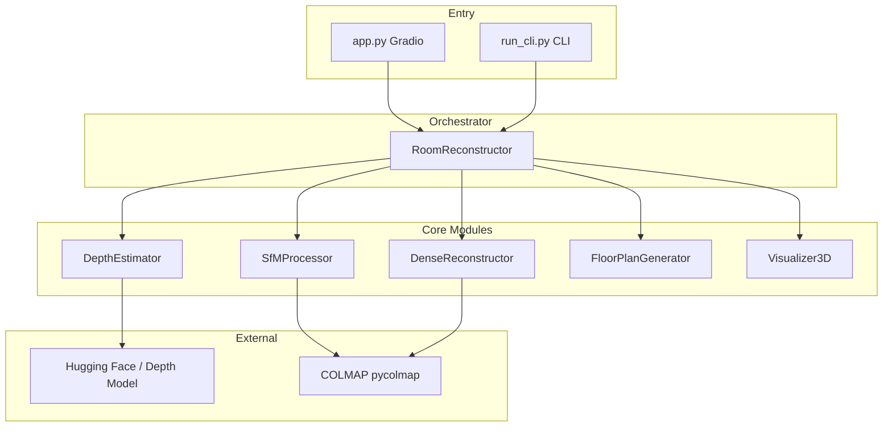
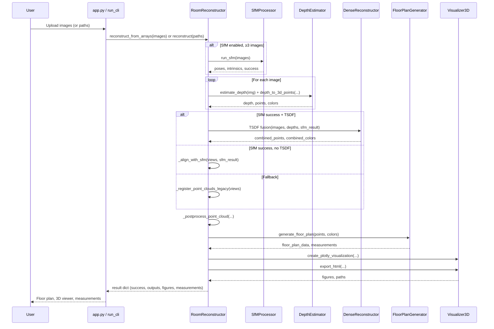
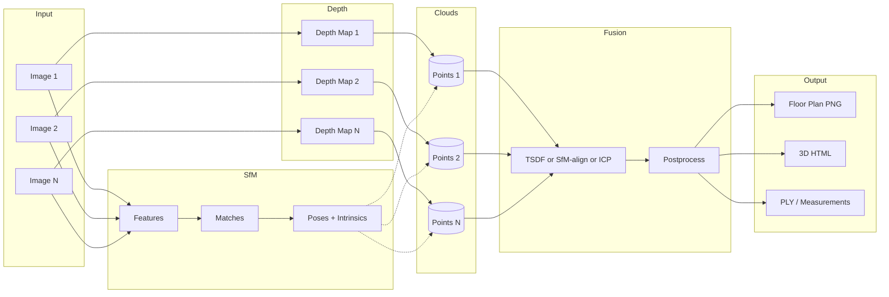

# Room Reconstruction Demo — Architecture

This document describes the architecture for developers and architects: entry points, main flow, components, data flow, and extension points.

---

## 1. Overview

The system reconstructs a room from **4–5 photographs** and produces:

- **2D floor plan** with approximate dimensions (meters & feet)
- **Interactive 3D model** (Plotly + HTML export)
- **Point cloud** (PLY) and optional mesh

**Design choices:**

- **Monocular depth + multi-view alignment:** Depth is estimated per image (Depth-Anything V2 / DPT); alignment uses **COLMAP SfM** when available, with fallbacks to **TSDF fusion** or **ICP-based registration**.
- **Single orchestrator:** `RoomReconstructor` owns the pipeline; other modules are stateless or hold minimal state (e.g. SfM workspace).
- **Configuration in one place:** `config.py` holds paths, model names, and reconstruction parameters.

---

## 2. Entry Points

| Entry Point | Role | Invocation |
|-------------|------|------------|
| **app.py** | Gradio web UI; lazy-loads `RoomReconstructor` on first request | `uv run python app.py` → http://localhost:7860 |
| **run_cli.py** | CLI: globs image paths, calls `RoomReconstructor.reconstruct()` | `uv run python run_cli.py img*.jpg [--room-width 5.0] [--visualize]` |

Both paths end up calling `RoomReconstructor.reconstruct(image_paths)` or `RoomReconstructor.reconstruct_from_arrays(image_arrays)`.

---

## 3. High-Level Pipeline Flow

```text
Images (4–5) → SfM (optional) → Depth per image → Point clouds per view
     → Align & fuse (TSDF / SfM-align / ICP) → Postprocess
     → Floor plan + 3D viz + HTML/PLY export
```

- **SfM:** When enabled and ≥3 images, COLMAP (via `SfMProcessor`) runs first to get camera poses and intrinsics.
- **Depth:** Each image is passed through `DepthEstimator` (Depth-Anything V2 or Intel DPT); optionally using SfM intrinsics.
- **Point clouds:** Depth + RGB → 3D points per view (pinhole back-projection).
- **Fusion order:**  
  1. If SfM succeeded and TSDF is on → **TSDF fusion** (`DenseReconstructor`).  
  2. Else if SfM succeeded → **SfM-based alignment** (transform clouds by SfM poses).  
  3. Else → **Legacy ICP/RANSAC registration** (`_register_point_clouds_legacy`).  
- **Postprocess:** Remove non-finite, statistical outlier removal, voxel downsampling.
- **Outputs:** `FloorPlanGenerator` (2D + measurements), `Visualizer3D` (Plotly figure + HTML + PLY).

---

## 4. Component Diagram (Mermaid)



**Responsibilities:**

- **RoomReconstructor:** Load images, run SfM (if enabled), run depth per image, build per-view point clouds, decide fusion path (TSDF / SfM-align / legacy), postprocess, call floor plan and 3D viz, return result dict.
- **DepthEstimator:** Load depth model (Hugging Face), `estimate_depth(image)`, `depth_to_3d_points(image, depth, ...)`.
- **SfMProcessor:** Prepare workspace, run COLMAP pipeline (feature extract → match → incremental SfM), extract camera poses and intrinsics (`cam_from_world()`, etc.).
- **DenseReconstructor:** TSDF fusion from multiple depth maps + SfM poses; optional mesh/point cloud extraction.
- **FloorPlanGenerator:** Top-down slice of point cloud → density map, wall detection, measurements, floor plan image.
- **Visualizer3D:** Plotly figure, HTML export, PLY export, optional Open3D window.

---

## 5. Reconstruction Flow (Sequence)



---

## 6. Data Flow (Mermaid)



- **SfM** uses the same images to produce poses and intrinsics; those optionally drive **Depth** (intrinsics) and **Fusion** (alignment).
- **Depth** produces one depth map per image, then **Clouds** are one point cloud per view.
- **Fusion** merges clouds (TSDF / SfM-align / ICP) and **Postprocess** cleans the result.
- **Output** is generated from the single combined point cloud.

---

## 7. Key Configuration (`config.py`)

| Area | Important Variables | Purpose |
|------|---------------------|--------|
| **Depth** | `DEPTH_MODEL`, `DEPTH_MODEL_FALLBACK`, `DEPTH_MAX_SIZE` | Which Hugging Face model, fallback, input size |
| **Paths** | `OUTPUT_DIR`, `COLMAP_WORKSPACE`, `SAMPLE_DIR` | Where outputs and SfM workspace live |
| **3D** | `POINT_CLOUD_DENSITY`, `VOXEL_SIZE`, `DEPTH_SCALE` | Sampling, downsampling, depth scale |
| **Registration** | `REGISTRATION_VOXEL_SIZE`, `REGISTRATION_RANSAC_ITERATIONS`, `REGISTRATION_ICP_ITERATIONS` | Legacy ICP/RANSAC behavior |
| **SfM** | `ENABLE_SFM`, `SFM_MIN_IMAGES`, `SFM_FEATURE_TYPE`, `SFM_MAX_IMAGE_SIZE` | Turn SfM on/off, COLMAP options |
| **Floor plan** | `ASSUMED_ROOM_WIDTH_METERS`, `FLOOR_PLAN_HEIGHT_MIN/MAX` | Scale and floor slice height |
| **Dense** | `DEPTH_FUSION_METHOD` (`tsdf` / `poisson`) | How to fuse when SfM succeeds |

Changing behavior (e.g. different depth model, no SfM, different voxel size) is done here without touching orchestration logic.

---

## 8. Extension Points

- **Depth model:** Swap `DEPTH_MODEL` / `DEPTH_MODEL_FALLBACK` in `config.py`; `DepthEstimator` already supports multiple backends (Depth-Anything V2, DPT) and fallback on load failure.
- **Fusion strategy:** In `RoomReconstructor.reconstruct_from_arrays`, the order is TSDF → SfM-align → legacy; add or reorder branches (e.g. another fusion module) in that block.
- **Floor plan / 3D:** Replace or wrap `FloorPlanGenerator` and `Visualizer3D`; interface is `generate_floor_plan(points, colors)` and `create_plotly_visualization` / `export_html`.
- **SfM:** `SfMProcessor` is optional; if `ENABLE_SFM` is False or pycolmap is missing, the pipeline uses only legacy registration.
- **New outputs:** In the same block where `floor_plan_data`, `plotly_fig`, and `html_path` are produced, add further generators and add keys to the returned `result` dict and, if needed, to the Gradio/CLI response.

---

## 9. Dependencies (High Level)

- **PyTorch + Transformers:** Depth model loading and inference.
- **Open3D:** Point clouds, TSDF, ICP/RANSAC, voxel downsampling, outlier removal.
- **pycolmap:** COLMAP SfM (feature extraction, matching, incremental SfM).
- **Gradio:** Web UI in `app.py`.
- **Plotly / Matplotlib:** 3D figure and floor plan rendering.
- **OpenCV, NumPy, SciPy, scikit-image:** Image I/O, preprocessing, and floor-plan logic.

All dependencies are listed in `requirements.txt`; the project is intended to be run with **uv** (`uv sync`, `uv run python app.py`).

---

## 10. First Run and Model Download

On **first run**, the depth model (e.g. Depth-Anything-V2 or Intel/dpt-large) is downloaded from Hugging Face (~350MB–1GB). This can take several minutes. Later runs use the cached model. No extra steps are required; see README for troubleshooting (e.g. `HF_TOKEN` for rate limits).

---

*This architecture document is part of the [Room Reconstruction Demo](https://github.com/rajeshkanaka/Room-Reconstruction-Demo) repository.*
